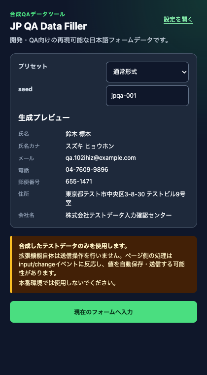
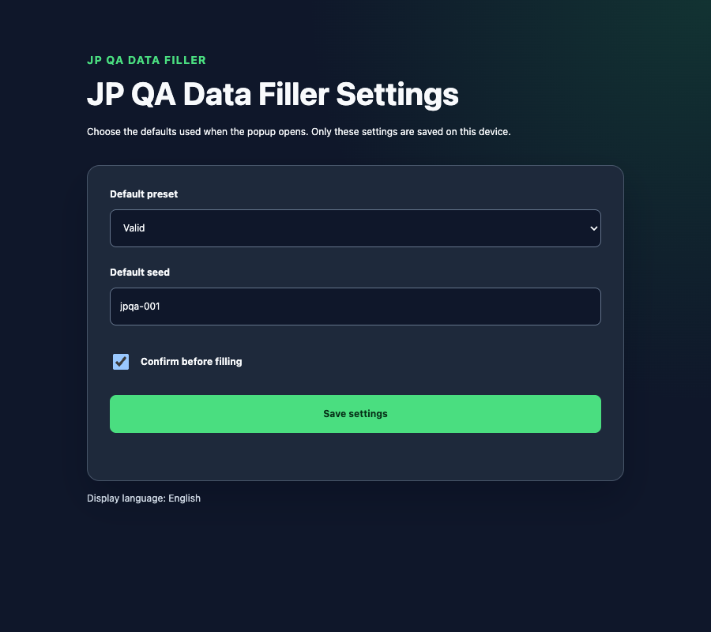

# JP QA Data Filler

[](https://github.com/50ra4/jp-qa-data-filler/actions/workflows/ci.yml)

A Chrome Manifest V3 extension that fills recognizable Japanese web-form fields with deterministic synthetic data. It is intended for development, QA, and demonstrations—not production systems.

JP QA Data Filler was derived from [`50ra4/crx-vite-ts-react-template` v1.0.0](https://github.com/50ra4/crx-vite-ts-react-template/releases/tag/v1.0.0).

[日本語 README](docs/README.ja.md)

## Safety boundaries

- Runs only after the user opens the popup and explicitly chooses to fill the active tab.
- Never clicks controls, accepts terms, or invokes form submission itself.
- Never fills passwords, one-time codes, credit-card fields, hidden fields, disabled fields, or read-only fields.
- Does not include a persistent content script, host permission, backend, analytics SDK, or remote code.
- Stores only the default preset, seed, and confirmation preference in `chrome.storage.local`.
- Does not save or independently transmit generated profiles, form values, page URLs, field names, or page HTML.
- Dispatches bubbling `input` and `change` events for controlled forms. Host-page scripts can react by autosaving, submitting, or transmitting the inserted values; use only local fixtures or dedicated QA environments.

See the [privacy policy](docs/privacy.md) for the complete data statement.

## Screens





## Features

- Three presets: `valid`, `boundary`, and `invalid`.
- Reproducible profiles from the same preset and seed without `Math.random()` or current time.
- Fourteen field kinds: full/family/given name, their Kana forms, email, phone, postal code, prefecture, locality, street address, full address, and organization.
- Conservative detection led by standard `autocomplete` tokens, then explicit labels/ARIA, `name`/`id`, and placeholders.
- Native value setters plus bubbling, composed `input` and `change` events for controlled form implementations.
- Top-frame and recursively open Shadow DOM support.
- Bilingual Japanese/English popup and settings UI.
- Detailed filled, skipped, unmatched, warning, and error results.

## Use

1. Open a local fixture or dedicated QA/demonstration form whose event-driven behavior is safe to trigger.
2. Open the extension popup.
3. Choose a preset and seed, then review the generated preview.
4. Select **Fill current form** and review the event-side-effect warning before confirming.
5. Review the result in the popup and inspect the form. Submit manually only if appropriate for the test environment.

The `valid` preset validates string shapes only. Generated phone numbers, postal codes, and addresses are synthetic and are not guaranteed to be assigned, deliverable, or real.

## Unsupported forms

- Cross-origin and same-origin iframes
- Closed Shadow DOM
- Contenteditable and custom controls that do not expose a native `input`, `textarea`, or prefecture `select`
- Ambiguous fields without strong autocomplete, label, ARIA, `name`, or `id` evidence
- Site-specific selector mappings
- CAPTCHA, consent controls, and form submission
- Browsers other than Chrome

## Permissions

| Permission  | Why it is required                                                                   |
| ----------- | ------------------------------------------------------------------------------------ |
| `activeTab` | Grants temporary access to the tab only after the user invokes the extension action. |
| `scripting` | Injects the self-contained fill function for the explicit fill action.               |
| `storage`   | Stores the default preset, seed, and confirmation preference locally.                |

Production `host_permissions`, `content_scripts`, background service workers, and `web_accessible_resources` are absent. See [Web Store copy and permission text](docs/web-store.md).

## Development

Requirements: Node.js 24 or later and Chromium installed for Playwright.

```bash
npm ci
npm run dev
npm run verify
npm run verify:full
npm run package
```

`npm run verify:full` runs type checking, lint, unit/component tests, a production build, manifest verification, and real-Chromium E2E tests. E2E copies the built extension to a temporary directory and adds a localhost host permission only to that copy; the production manifest remains unchanged.

For browser checks, follow [the manual test plan](docs/manual-test.md). Release packaging is documented in [docs/releasing.md](docs/releasing.md).

## Architecture

```text
src/entrypoints/popup   preset/seed preview, confirmation, execution result
src/entrypoints/options local default settings
src/lib/generator       deterministic profile generation
src/lib/injection       DOM classifier/filler and active-tab wrapper
src/lib/i18n            Japanese/English UI messages
src/lib/storage         typed local settings storage
src/lib/testing         shared Chrome API fake
```

Dependency direction remains `entrypoints → lib`. Real `chrome.*` access stays under `src/lib/**`. There is no runtime messaging layer because this product has no background or content-script surface.

## License

[MIT](LICENSE)
